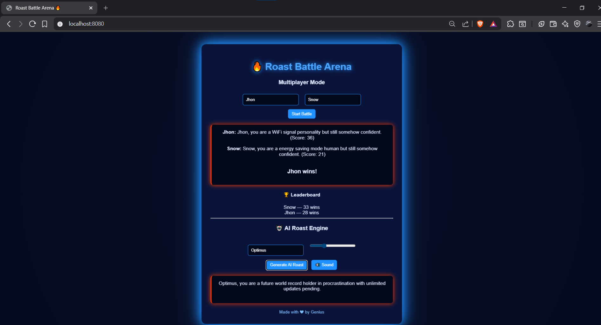

# 🔥 Roast Me Machine

A fun and interactive web app that generates random roasts based on selected mode (Soft or Savage). Built using **HTML, CSS, and JavaScript** with LocalStorage support.

---

## 🚀 Features

- 🎭 Two Roast Modes:
  - **Soft** – Light and funny roasts
  - **Savage** – Brutal and savage roasts
- 🎲 Random roast generator
- 📊 Roast counter
- 📋 Copy roast to clipboard
- 📤 Share roast (if supported by browser)
- 🕘 Roast history display
- 🌙 Dark themed modern UI

---

## 🛠️ Technologies Used

- HTML5
- CSS3 (Dark theme + Glow animation)
- JavaScript  
  - DOM Manipulation  
  - LocalStorage  
  - Clipboard API  
  - Web Share API  

---

## 📂 How to Run

1. Download or clone this repository.
2. Open the `index.html` file in your browser.
3. Enter your name.
4. Select roast mode (Soft or Savage).
5. Click **"Roast Me"** and enjoy 🔥

---

## 💡 How It Works

- A random roast is selected from predefined arrays.
- Total roast count is stored using **LocalStorage**.
- Generated roasts are added to the history section.
- Users can save, copy, or share their favorite roast.

---

## 📸 Preview

---

## 👨‍💻 Author

Made with ❤ by **Genius**

